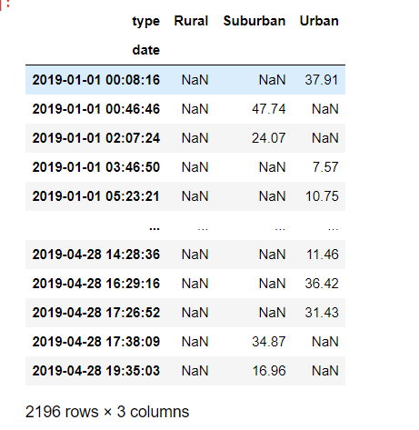
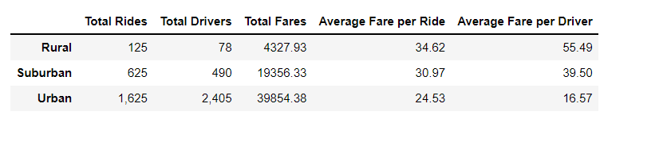
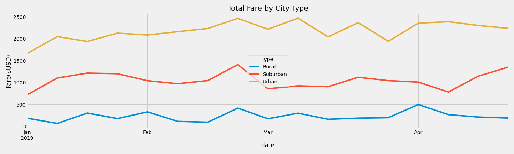

# A ride-sharing by city type analysis - PyBer_Analysis

## Overview of the analysis: 
The purpose of the analysis is to visualize the differences in ride-sharing data among the different city types. I analyzed the given databases by merging dbases, creating statistics using NumPy,SciPy, Pandas. After using matplotlib graphs and applying Pandas methods, functions, conditional expressions on series and dataframes I created statistical results in tables and charts to analyse ride-sharing data.

## Results: 
PyBer has giving us two data files, one is for the city and the other is for the rides. These tables had information on city type i.e rural, urban and suburban, fare, driver count, city name and ride id. After analyzing the databases we can join the two on city names to create summary of the data. Merging city and ride databases and creating by weekly ride summary for the total fares and each city type gives us detailed information about rides by city types. Using the merged database we created a pivot table with the date as index and columns as type and values as fare as seen in the image below. 

After completing statistical calculations on the given data we can visualize the results by city type and total rides, total drivers, total fares, average fare per ride and average fare per driver. Using the stats data we can create a summary of the stats on city types. This table demonstrates that the "rural" cities has less rides with less driver, generates higher fare per ride and per driver. Suburban cities comes second in generating higher fare per ride and per driver with a higher number of drivers and rides. Finally the "urban" city type comes lowest is generating less fair per ride and driver with the hightest number of drivers and highest number of rides.  A ride-sharing summary DataFrame by city type can be seen in the image below.

Using the merged database we created a pivot table wtih the date as index and columns as type and values as fare. Creating a dataframe from this pivot table and given dates from Jan 2019 to April 2019 we created a weekly sum of the fares. Using this information and matplotlib we created a multiple-line graph that shows the total weekly fares for each city type. Using this chart we can describe the differences in ride-sharing data among the different city types. For all city types the fares are higher at the end of February. For rural cities fares are steady from Jan to April and slightly lowers towards end of April. For suburban cities fares are highte at the end of Feb then lowers and starts to pick up in April. For urban cities fares are increasing from Jan to end of Feb then goes higher/lower from March and kind of steadyly high in April.

Overall rural area fares around 5K, suburban fares are 2K and urban fares are 4K. That means the the urban area in total earns much more but the share per driver and fare are the lowest. Rural area fares are the lowest but the fare per driver compare to urban city is 40 dolar higher and ride compare to urban city is 10 dollar higher.

## Summary: 
Based on the results three business recommendations to the CEO for addressing any disparities among the city types:
1. In rural areas increasing the number of drivers would decrease the average fare per driver allowing more drivers to earn income and creating jobs
2. Lowering the number of drivers in Urban areas would increase the average fare per driver resulting in more income for less drivers
3. For the suburban cities there is sharp decline on the number of fares at the end of February to March. If this is the annual decline you can reduce the number of drivers during this period to cut on your cost. This would also increase the income for the rest of the drivers.
